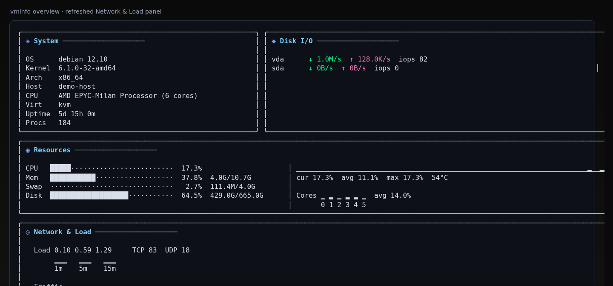
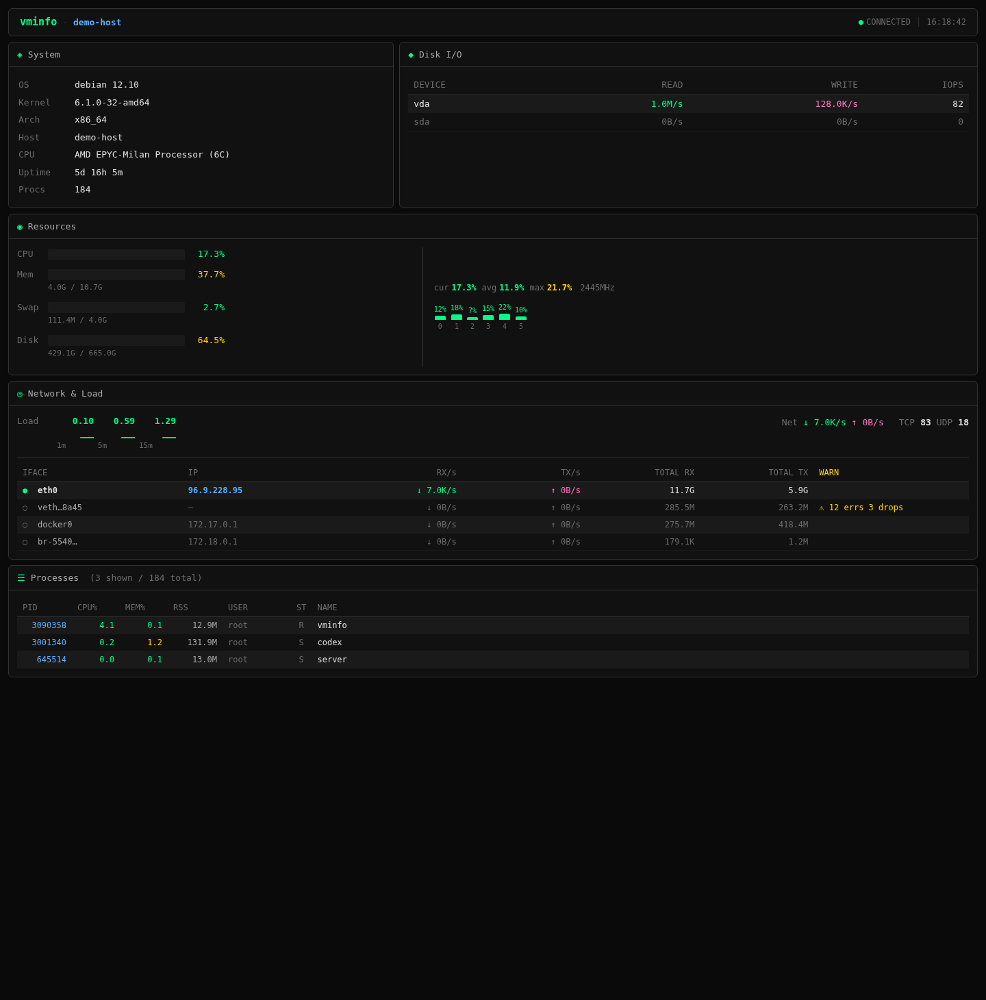
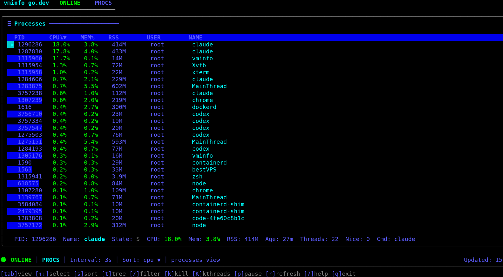
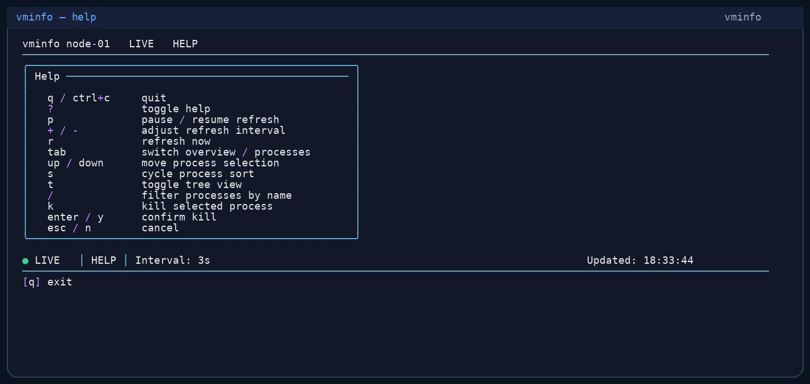

## Установка одной командой

```bash
curl -fsSL https://raw.githubusercontent.com/cloudapp3/vminfo/main/install.sh | bash
```

Затем запустите терминальный UI:

```bash
vminfo
```

Или получите JSON-снимок для скриптов:

```bash
vminfo summary --json
```

## Почему vminfo

vminfo создан для разработчиков, SRE- и DevOps-инженеров и администраторов серверов, которым нужен низкопороговый способ получить видимость состояния машины.

Используйте его, когда нужно:

- посмотреть CPU, память, диск, сеть, нагрузку и процессы из терминала
- экспортировать машиночитаемый JSON для скриптов и автоматизации
- открыть браузерный дашборд на сервере через `vminfo --web`
- встроить сбор метрик хоста в другой Go-инструмент
- продиагностировать отдельный хост без развёртывания полноценной платформы мониторинга

## Скриншоты

<div class="vminfo-screenshot-grid">
  
  
  
  
</div>


## Быстрые ссылки

- [Быстрый старт](/ru/quick-start)
- [Установка](/ru/installation)
- [Развёртывание](/ru/deployment)
- [Справочник команд](/ru/commands)
- [HTTP API](/ru/api)
- [Библиотека Go](/ru/library)
- [中文文档](/zh/)
- [日本語ドキュメント](/ja/)
